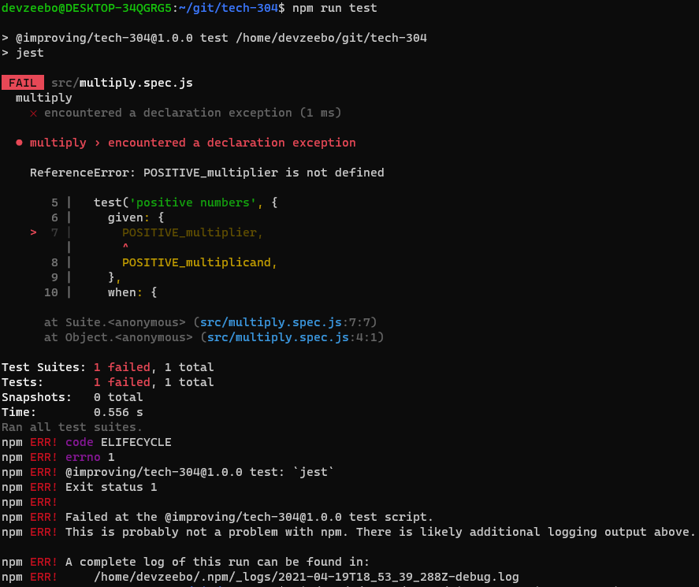
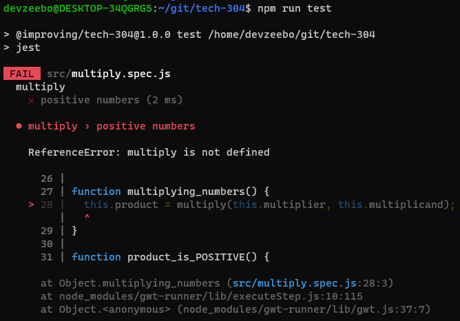
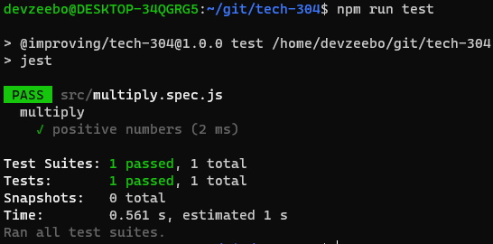

# Testing - Getting Started

## Install Packages

1. `npm i -D jest jest-gwt`
   * `jest`: https://jestjs.io/
   * `jest-gwt`: https://github.com/devzeebo/jest-gwt

## Your first test

> GIVEN a POSITIVE multiplier<br />
> AND a POSITIVE multiplicand<br />
> WHEN multiplying numbers<br />
> THEN the product is POSITIVE<br />

### GIVEN
Describe the state of the world _before_ your test runs. There can be more
than one `given` clause! Prefer multiple clauses to one mega-clause.

### WHEN
Describe _what_ your test is testing. There can be more than one `when`
clause! Break out multiple clauses when it becomes a sequence of actions.

### THEN
Describe the state of the world _after_ your test runs. There can be more
than one `then` clause!

```javascript
// src/multiply.spec.js
import test from 'jest-gwt';

describe('multiply', () => {
  test('positive numbers', {
    given: {
      POSITIVE_multiplier,
      POSITIVE_multiplicand,
    },
    when: {
      multiplying_numbers,
    },
    then: {
      product_is_POSITIVE,
    },
  });
});
```

> Run:
> ```javascript
> npm run test
> ```

### What failure looks like



1. There is one test suite found, and it failed
2. There is one test across all tests, and it failed
3. `POSITIVE_multiplier` is not defined

### Fixing the test

```javascript
describe('', () => {
// ...
});

function POSITIVE_multiplier() {
  this.multiplier = 5;
}

function POSITIVE_multiplicand() {
  this.multiplicand = 3;
}

function multiplying_numbers() {
  this.product = multiply(this.multiplier, this.multiplicand);
}

function product_is_POSITIVE() {
  expect(this.product).toBe(15);
}
```



## Implementing multiply.js

```javascript
// src/multiply.js
export default (a, b) => a * b;
```

and import into multiply.spec.js:
```javascript
// src/multiply.spec.js
import test from 'jest-gwt';

import multiply from './multiply';

describe('multiply', () => {
  // ...
});

// ...functions
```

### What success looks like



It passed! Are there other test cases we should test? I can think of 5 more

[Additional Test Cases](./01_getting_started_all_cases.md)

Are there any others you can think of?